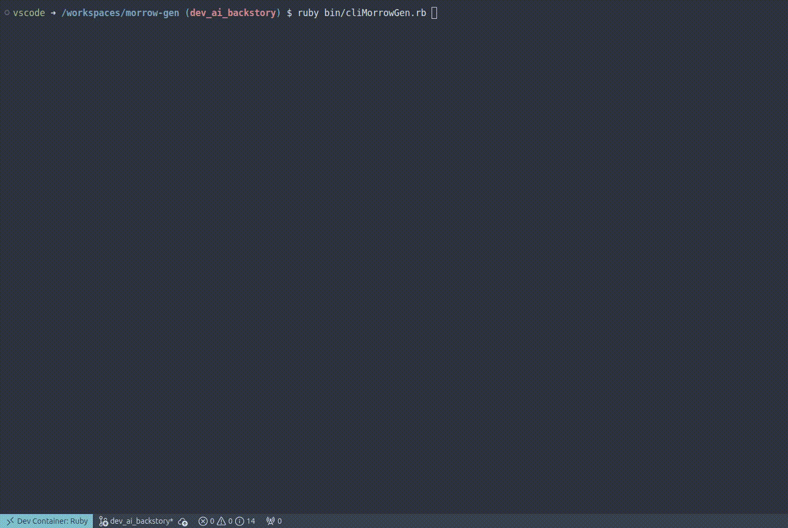

# Morrowind Lore-Accurate Character Generator





Ruby application that generates **sound** and **lore-accurate** character sheets for *The Elder Scrolls III: Morrowind*.

## Features

### **Lore-Accurate Naming Engine:**
* Generates race-specific names (e.g., "Ash-Hanta" for Ashlanders, "Moghakh" for Orcs).
* **Argonians:** Generates dynamic Cyrodilic phrases (e.g., *"Hides-His-Eyes"*, *"Walks-In-Shadows"*) or traditional Jel names.
* **Orcs:** Correctly handles gendered surnames (`gro-` for males, `gra-` for females).
* **Imperials:** Context-aware gender suffixes for Roman-style names.

### **True Stat Calculation:**
* Calculates **Attributes** by summing: `Race Base Stats` + `Gender Differences` + `Birthsign Bonuses` + `Class Favored Attributes`.

### **Advanced Class Generator:**
* **Standard Mode:** Select from the classic, pre-made Morrowind classes.
* **Smart Mode:** Procedurally generates cohesive, playable classes using **"Architected Randomness"**.
  * Enforces logic rules (e.g., no conflicting armor types, mandatory offense/defense slots).
  * Auto-calculates Favored Attributes based on your skill spread.
  * Auto-names your class based on its archetype (e.g., "Battlemage", "Nightblade").
* **Chaos Mode:** Pure random generation for wild, unpredictable builds.

### **AI Lore Master:**
* **Powered by Google Gemini:** Integrates with the LLM to write custom backstories on the fly.
* **Context Aware:** Explicitly reads your generated Stats, Skills, and Class to weave a narrative that explains *why* your character is the way they are.
* **Thematic Generation:** Choose a "Vibe" (e.g., Gritty, Heroic, Mystical) and an "Origin" (e.g., Political Prisoner, Heretic) to guide the storyteller.
* **Lore Compliant:** Ensures the story always ends correctly: bound in chains on the Emperor's ship, heading to Seyda Neen.

### **Complete Skill Generation:**
* Assigns **Major** (Base 30), **Minor** (Base 15), and **Misc** (Base 5) skills.
* Applies **+5 Specialization Bonus** (Combat/Magic/Stealth) to all relevant skills.
* Applies **Racial Bonuses** (e.g., Dunmer get +10 Destruction).
* Outputs the final, calculated value for every skill.

## Installation

1. Clone the repository.
2. Install the required gems (using Make):
```bash
make install
```

3. **(Optional) Enable AI Features:**
Get a free API Key from [Google AI Studio](https://aistudio.google.com/).
Create a `.env` file in the project root:

```env
GEMINI_API_KEY=your_actual_api_key_here
SESSION_SECRET=some_random_string_for_web_security
```

## Usage

You can run the generator in two ways using the included `Makefile`:

### 1. Web Interface (New!)

Launches a modern, dark-themed web interface running locally. Supports mobile layouts and dynamic updates.

```bash
make run_webui
```

*Open your browser to `http://localhost:4567*`

### 2. Terminal Interface (Classic)

The original TTY-based interactive CLI. Navigate through menus to select your gender, race, and class generation method directly in your terminal.

```bash
make run_cli
```

*(You can also use `make help` to see all available commands)*

## Output Example (CLI)

```text
Welcome to the Morrowind Character Generator
Choose your gender: Male
Choose your race: Nord
Choose Class Generation Method: Smart Random (Lore-friendly custom class)
------ PREVIEW ------
[ Agent ] (Stealth)

Attributes: AGI, PER

Major Skills:
- Hand to hand
- Light armor
- Block
- Mercantile
- Speechcraft

Minor Skills:
- Destruction
- Conjuration
- Enchant
- Medium armor
- Restoration
---------------------

Do you want to name this class? Yes
Enter class name: MyClass

╔ CHARACTER ═══════════════════════════════════════════════════════════════════════════╗
║                                                                                      ║
║ IDENTITY                                                                             ║
║       Name:      Hurg                                                                ║
║       Race:      Male Nord                                                           ║
║       Birthsign: The Serpent                                                         ║
║       Class :    MyClass                                                             ║
║ ------------------------------------------------------------------------------------ ║
║ ATTRIBUTES                                                                           ║
║       STR: 50                        INT: 30                                         ║
║       WIL: 40                        AGI: 40                                         ║
║       SPD: 40                        END: 50                                         ║
║       PER: 40                        LUC: 40                                         ║
║ ------------------------------------------------------------------------------------ ║
║ SKILLS                                                                               ║
║                                                                                      ║
║ Major:                        Minor:                                                 ║
║       30 Block                       25 Medium armor                                 ║
║       35 Light armor                 15 Conjuration                                  ║
║       35 Hand to hand                15 Enchant                                      ║
║       35 Mercantile                  15 Destruction                                  ║
║       35 Speechcraft                 15 Restoration                                  ║
║                                                                                      ║
║ Other:                                                                               ║
║       10 Heavy armor                  5 Alteration                                   ║
║       10 Spear                        5 Mysticism                                    ║
║        5 Armorer                      5 Unarmored                                    ║
║       15 Axe                         10 Acrobatics                                   ║
║       15 Blunt weapon                10 Marksman                                     ║
║       10 Long blade                  10 Sneak                                        ║
║        5 Athletics                   10 Short blade                                  ║
║        5 Illusion                    10 Security                                     ║
║        5 Alchemy                      5 Luck                                         ║
║                                                                                      ║
╚══════════════════════════════════════════════════════════════════════════════════════╝

Consult the Elder Scrolls? (Generate AI Backstory) Yes
Choose the story's vibe: Heroic
Choose their origin: Political Prisoner
Any specific details to include? (Press Enter to skip): This nord is fearless, walks shirtless and hates Witches
[⠹] Consulting the Moth Priests...   (LoreGenerator connected to: models/gemini-2.5-flash)
[✔] Consulting the Moth Priests... (Done!)

╔ LORE ════════════════════════════════════════════════════════════════════════╗
║                                                                              ║
║ Hurg, a son of Skyrim's colder reaches, was a Nord forged in the harsh       ║
║ traditions of his homeland. His broad, unyielding frame, often bared to the  ║
║ elements, was a testament to his raw strength and the Serpent's              ║
║ unpredictable vitality that coursed through him. Fearless in the face of     ║
║ danger and quick to anger when injustice arose, Hurg had little patience for ║
║ the cunning tricks of mages, reserving a particular, fiery disdain for those ║
║ he called 'Witches' – practitioners of the arcane who preyed on the weak,    ║
║ whose deceitful illusions and destructive spells he found abhorrent.         ║
║ His renown grew not from scholarly pursuits, for which he had little         ║
║ patience, but from his booming voice in the taverns of Riften and his        ║
║ readiness to defend the common folk. He once exposed a corrupt Jarl's        ║
║ steward, who, with the aid of a dark Conjurer, had been extorting local      ║
║ merchants and coercing citizens with foul enchantments. Hurg’s powerful      ║
║ blows and surprisingly sharp wits, coupled with his ability to rally the     ║
║ populace, saw the steward's arcane shield shattered and his magical          ║
║ accomplice driven from the city, though not without a lingering scar on      ║
║ Hurg's soul from the dark magic he'd faced.                                  ║
║ Such defiant acts of heroism, however, drew the ire of those in power who    ║
║ valued order above justice. Though celebrated by the people, Hurg's          ║
║ disruptive influence and unwavering refusal to bow to imperial authority     ║
║ made him a liability. Falsely accused of sedition against the Crown, Hurg    ║
║ was apprehended in a rigged trial, his protests of innocence falling on deaf ║
║ ears. Now, stripped of his few possessions and bound in the brig, he endures ║
║ the rough voyage to Vvardenfell aboard an Imperial prison ship, destined for ║
║ Seyda Neen.                                                                  ║
║                                                                              ║
╚══════════════════════════════════════════════════════════════════════════════╝

```

## Roadmap

* [x] **Interactive CLI:** A robust menu system for easier selection.
* [x] **Web Interface:** A local Sinatra-based web UI with dark mode and mobile support.
* [x] **Custom Class Generator:** Random, yet **sound** class gen using "Architected Randomness".
* [x] **AI Backstories:** Integration with LLMs to generate biographies.
* [ ] **AI Illustrations:** (Planned) Visual generation of characters and critical story moments.
